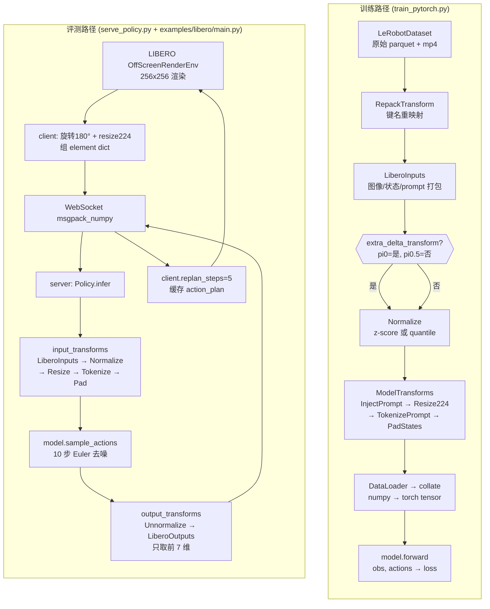
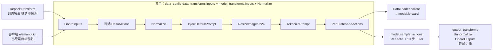

# pi0 / pi0.5 数据流脉络笔记

> 目的：把"训练数据变换"与"LIBERO 仿真器评测数据流"的代码脉络串起来，
> 方便随时跳转到对应文件和行号阅读源码。
>
> 对应任务：
> - 训练时从 LeRobotDataset → `model.forward(observation, actions)` 的每一层做了什么
> - 评测时从 LIBERO Env → WebSocket → `policy.infer()` → 返回 action chunk 的全链路
>
> 本仓库是 openpi（pi0 / pi0.5 / pi0-FAST），LIBERO 是数据集 + 仿真环境。

---

## 0. 总览（先看这张图）



两条路径共用的"锚点"是 `LeRobotLiberoDataConfig.create()`：训练和推理都从这里派生
`data_transforms.inputs`，所以模型看到的 tensor 格式是一致的。

---

## 1. LeRobot 数据集格式（读训练流前的基础）

> 为什么要先看这一节：训练和推理的数据流最终都要落到"LeRobot 数据集长什么样"。
> 理解了这一节再读 `create_torch_dataset` 和 `LiberoInputs` 会非常顺。

### 1.1 LeRobot 是什么

HuggingFace 官方的**机器人数据集 + 策略框架**（[github.com/huggingface/lerobot](https://github.com/huggingface/lerobot)）。openpi 只用它的
**数据集格式和加载器**（`LeRobotDataset` / `LeRobotDatasetMetadata`），策略部分没用。

声明位置：[pyproject.toml:70](pyproject.toml#L70) 固定到某个 commit，用 `uv sync` 从 GitHub 装。

### 1.2 本地缓存路径（坑点！）

LeRobot **不用标准 HF hub 缓存**，而是自己维护一个人类可读的扁平路径：

```text
~/.cache/huggingface/lerobot/<repo_id>/    ← 真实数据在这里
~/.cache/huggingface/hub/datasets--<...>/  ← 只存 refs 指针，容易误以为没下
```

LIBERO 对应：

```text
~/.cache/huggingface/lerobot/physical-intelligence/libero/
├── meta/                                     ← 元信息（~200 KB，首次 init 即下）
│   ├── info.json          字段 schema
│   ├── episodes.jsonl     1693 个 episode 的索引
│   ├── tasks.jsonl        40 个任务的自然语言描述
│   └── stats.json         全局归一化统计量
├── data/                                     ← 真实样本（按需下载）
│   └── chunk-000/
│       ├── episode_000000.parquet  ~27 MB
│       ├── episode_000001.parquet
│       └── ...
└── .cache/                                   ← LeRobot 内部临时缓存
```

关键常量（LIBERO，来自 `info.json`）：

| 字段 | 值 | 含义 |
| --- | --- | --- |
| `total_episodes` | 1693 | 1693 条完整任务演示 |
| `total_frames` | 273,465 | 总帧数（≈7.6 小时 @10Hz） |
| `total_tasks` | 40 | 40 个任务（4 suite × 10） |
| `fps` | 10 | 10 Hz 采样（每 100ms 一帧） |
| `chunks_size` | 1000 | 每 1000 个 episode 打一个包目录 |
| `data_path` | `data/chunk-{chunk:03d}/episode_{episode:06d}.parquet` | 文件命名规则 |
| `total_videos` | **0** | **本数据集没 mp4，图像存在 parquet 里** |

估算完整数据集：`1693 × 27MB ≈ 45 GB`。

### 1.3 Parquet 是什么（不是视频）

**Parquet = 列式表格**（机器学习标准格式），不是视频。每个 episode 一个 `.parquet` 文件：

- 行数 = 该 episode 的帧数（LIBERO 平均 ~161 帧，典型 ~21 秒）
- 列数 = 9 个字段（见下表）
- 列式存储：按列压缩 + zstd/snappy，查询时只读需要的列
- PyPolars / Pandas / Spark 都原生支持

LIBERO 里 episode 0（214 帧 × 9 列 × 27MB）的字段：

| 列 | 类型 | 内容 |
| --- | --- | --- |
| `image` | `dict{'bytes': PNG}` | 第三人称摄像头，每帧一张 256×256 PNG |
| `wrist_image` | `dict{'bytes': PNG}` | 手腕摄像头，每帧一张 256×256 PNG |
| `state` | `f32 × 8` | eef_pos(3) + 姿态 axis-angle(3) + gripper(2) |
| `actions` | `f32 × 7` | δpos(3) + δrot(3) + gripper(1) |
| `timestamp` | `f32` | 秒数，从 0 开始 |
| `frame_index` | `int` | 当前 episode 内的帧序号 |
| `episode_index` | `int` | 全数据集 episode 编号 |
| `index` | `int` | 全局帧索引 |
| `task_index` | `int` | 哪个任务（0-39），查 `tasks.jsonl` 得自然语言 prompt |

**图像用 PNG bytes 直接内嵌 parquet 单元格**，不走 mp4：

```text
parquet 里      LeRobot __getitem__
─────────────  ─────────────────────────────────────────────
PNG bytes  →  PIL.open → np.array → torch.Tensor(3,256,256) float32 [0,1]
                                    CHW + /255.0
```

为什么 LIBERO 不用 mp4：

- **随机访问快**：mp4 要 seek 到关键帧，parquet 行查询几 ms
- **精确对齐**：一行一帧，state/action 不会和图像错位
- **PNG 无损**：mp4 H.264 有损压缩，微小伪影对训练不利
- **代价**：空间大（27MB vs mp4 可能 3-5MB）

某些 LeRobot 数据集（ALOHA、DROID）会用 mp4——判断方法是看 `info.json` 里字段 `"dtype"`：

- `"dtype": "image"` → 帧图在 parquet 里（LIBERO）
- `"dtype": "video"` → 另有 `videos/chunk-XXX/*.mp4`，要额外解码

### 1.4 一个 episode 是什么

**一个 episode = 一次完整任务演示**，典型 ~16 秒，LIBERO 任务示例：

| 层级 | 数量 | 含义 |
| --- | --- | --- |
| 数据集 | 1693 episodes | 所有任务演示 |
| 一个 episode | 一次任务 | 如 "把白杯子放到左盘子" |
| 一帧 | 0.1 秒 | 一组观测 (image + wrist_image + state) + 一个 action |
| 一个 action | 7 维向量 | 每帧 10 Hz 发一次增量动作 |

所以 214 帧 = 214 个连续 action 串起来完成一个任务，**不是"一个持续 21 秒的慢动作"**。

LIBERO 各 suite 最长 demo 长度（[examples/libero/main.py:61-68](examples/libero/main.py#L61-L68)）：

- libero_spatial: 193 帧（~19s）
- libero_object: 254 帧（~25s）
- libero_goal: 270 帧（~27s）
- libero_10: 505 帧（~50s，长程多步）
- libero_90: 373 帧（~37s）

### 1.5 `LeRobotDataset.__getitem__` 做什么

调 `ds[i]` 时 LeRobot 帮你做三件事：

1. 定位到第 i 帧所在的 `episode_XXX.parquet`，读那一行
2. 把 PNG bytes 解码为 `torch.Tensor(3, H, W) float32 [0,1]`（CHW + 归一化）
3. 如果有 `delta_timestamps`，再把"未来 N 帧的 actions"切成 chunk

`delta_timestamps` 的作用（[data_loader.py:190-195](src/openpi/training/data_loader.py#L190-L195)）：

```python
# LIBERO: fps=10, action_horizon=10
delta_timestamps = {"actions": [0/10, 1/10, ..., 9/10]}
                 = {"actions": [0.0, 0.1, 0.2, ..., 0.9]}  # 未来 1 秒
```

→ `ds[i]["action"]` 的 shape 就从 `(7,)` 变成 `(10, 7)`——一个 action chunk，正是 pi0 模型输入格式。

### 1.6 只下一个 episode 快速探索

```python
from lerobot.common.datasets.lerobot_dataset import LeRobotDataset

ds = LeRobotDataset('physical-intelligence/libero', episodes=[0])  # 只下 27MB
print(f'该 episode 有 {len(ds)} 帧')
s = ds[0]
# s['observation.image'] → Tensor(3, 256, 256) float32
# s['observation.state'] → Tensor(8,)
# s['action']            → Tensor(7,)   如不传 delta_timestamps
# s['task']              → str, 自然语言 prompt
```

想看第 0 帧的 RGB 画面：

```python
import io, PIL.Image, polars as pl
df = pl.read_parquet('~/.cache/huggingface/lerobot/physical-intelligence/libero/data/chunk-000/episode_000000.parquet')
PIL.Image.open(io.BytesIO(df['image'][0]['bytes'])).save('/tmp/f0.png')
```

想拼 214 帧成视频看操作过程：

```python
import imageio
frames = [PIL.Image.open(io.BytesIO(df['image'][i]['bytes'])) for i in range(len(df))]
imageio.mimsave('/tmp/ep0.mp4', frames, fps=10)   # 21 秒短视频
```

### 1.7 Checkpoint 和 LeRobot 数据集的绑定关系

一个训练好的 checkpoint 绑死在**特定机器人 + 相机 + 控制空间**上，**不能跨平台直接用**。至少这 4 维要匹配：

| 维度 | LIBERO 的要求 | 换平台要重训的原因 |
| --- | --- | --- |
| 动作空间 | 7 维：δpos(3)+δrot(3)+gripper(1) | 不同机器人关节/维度不同 |
| 状态空间 | 8 维：eef_pos(3)+姿态(3)+gripper(2) | 真机 state 可能是关节角度 |
| 相机 | 1 前视 + 1 手腕（256×256） | 真机布置可能完全不同 |
| 控制频率 | 10 Hz | 真机可能 50/100/500 Hz |

已发布的三个 pi0.5 checkpoint：

| Checkpoint | 训练数据 | 泛化性 |
| --- | --- | --- |
| `pi05_base` | 大杂烩预训练 | 不能直接用，**必须针对下游平台微调** |
| `pi05_libero` | LIBERO 仿真 | 只在 LIBERO 上跑得好，真 Franka 不行 |
| `pi05_droid` | DROID 真机多平台 | 对 DROID 涵盖的平台零样本可用 |

换新平台的标准流程：

1. 采几十到几千条演示数据（遥操作/脚本化），按 LeRobot 格式存
2. 抄 `LeRobotLiberoDataConfig`，改键名对上你的数据集（见第 6 节）
3. 跑 `python scripts/compute_norm_stats.py --config-name=<your_config>`
4. 从 `pi05_base/params` 加载权重，训 30k-100k 步
5. 搭评测客户端（参考 [examples/libero/main.py](examples/libero/main.py)），走 WebSocket

---

## 2. 训练数据流（每个环节在哪）

### 1.1 入口：`scripts/train_pytorch.py`

- [scripts/train_pytorch.py:125-128](scripts/train_pytorch.py#L125-L128) `build_datasets(config)` —
  只是一层薄包装，真正调的是 `_data.create_data_loader(config, framework="pytorch", shuffle=True)`。
- [scripts/train_pytorch.py:553-585](scripts/train_pytorch.py#L553-L585) 训练 loop：
  `for observation, actions in loader: losses = model(observation, actions)`
  —— `loader` 吐出的就是已经走完整条 transform pipeline 的 batch。

### 1.2 构建 Dataset + 套 Transform：`src/openpi/training/data_loader.py`

三个函数串成一条链：

1. [data_loader.py:130-210](src/openpi/training/data_loader.py#L130-L210) `create_torch_dataset()`
   - 用 `LeRobotDataset(repo_id, delta_timestamps=...)` 打开原始数据集。
   - `delta_timestamps` 把 "未来 `action_horizon` 帧的 actions" 预先切片出来（LIBERO 里 horizon=10）。
   - 如果 `prompt_from_task=True`，包一层 `PromptFromLeRobotTask` 把 `task_index` → 自然语言 prompt。

2. [data_loader.py:231-250](src/openpi/training/data_loader.py#L231-L250) `transform_dataset()`
   - 把 `data_config` 里配置的四组 transform 顺序 compose：
     ```python
     [
         *data_config.repack_transforms.inputs,   # 键名重映射
         *data_config.data_transforms.inputs,     # LiberoInputs (+ 可选 DeltaActions)
         _transforms.Normalize(norm_stats, ...),  # z-score / quantile
         *data_config.model_transforms.inputs,    # InjectPrompt + Resize + Tokenize + Pad
     ]
     ```
   - 这就是你手绘图里 `RepackTransform → LiberoInputs → Disturbance&Delta → Normalize → model_transform` 的
     **真实顺序**（下面有个小更正：本仓库里没有 "Disturbance" 这一层，只有可选的 Delta）。

3. [data_loader.py:330-397](src/openpi/training/data_loader.py#L330-L397) `create_torch_data_loader()`
   - 里面是标准 `torch.utils.data.DataLoader`，加了个 `_collate_fn` 把 per-sample 的 numpy/jax 数组
     沿 batch 维 stack 起来（[data_loader.py:530-534](src/openpi/training/data_loader.py#L530-L534)）。
   - DDP 时会套 `DistributedSampler` 并把 batch 按 world_size 切分。

4. [data_loader.py:589-599](src/openpi/training/data_loader.py#L589-L599) `DataLoaderImpl.__iter__`
   - `yield _model.Observation.from_dict(batch), batch["actions"]`
   - 这就是 train_loop 里 `for observation, actions in loader` 拿到的对象。

### 1.3 每一层 transform 具体做了什么

所有 transform 都是 `DataTransformFn`（`src/openpi/transforms.py` 里定义 Protocol），输入/输出都是 `dict`。

| 层 | 代码位置 | 作用 |
| --- | --- | --- |
| RepackTransform | [transforms.py:79-101](src/openpi/transforms.py#L79-L101) | 把 LeRobot 原始键（如 `image`, `wrist_image`, `state`）**改名**成统一 schema（`observation/image`, `observation/wrist_image`, `observation/state`）。只在训练时用，推理时 env 已经直接吐对的键名。 |
| LiberoInputs | [libero_policy.py:29-83](src/openpi/policies/libero_policy.py#L29-L83) | 解析图像到 uint8 HWC；把 `observation/*` 打包成 `{state, image:{base/left/right}, image_mask, (actions?), (prompt?)}`。**右腕相机不存在 → 补零 + mask=False**（pi0-FAST 除外）。 |
| DeltaActions（可选） | [transforms.py:203-222](src/openpi/transforms.py#L203-L222) | `actions[..., :dims] -= state[..., :dims]` 把绝对动作变相对动作。只在 `extra_delta_transform=True` 时加上。 |
| Normalize | [transforms.py:114-145](src/openpi/transforms.py#L114-L145) | z-score 或 quantile（pi0 用 z-score，pi0.5/pi0-FAST 用 quantile，见 `create_base_config` L187）。norm_stats 在首次训练前要跑 `scripts/compute_norm_stats.py` 生成。 |
| InjectDefaultPrompt | [transforms.py:104-111](src/openpi/transforms.py#L104-L111) | 若 batch 没有 `prompt` 键，注入默认值。训练时通常不触发，推理时如果客户端没传 prompt 会用这个兜底。 |
| ResizeImages | [transforms.py:184-191](src/openpi/transforms.py#L184-L191) | 所有相机图像 `resize_with_pad` 到 224×224。 |
| TokenizePrompt | [transforms.py:247-266](src/openpi/transforms.py#L247-L266) | 用 PaligemmaTokenizer 把 prompt → `tokenized_prompt` + `tokenized_prompt_mask`。pi0.5 的 `discrete_state_input=True` 时还会把 state 离散化成 256-bin 拼进 prompt。 |
| PadStatesAndActions | [transforms.py:327-337](src/openpi/transforms.py#L327-L337) | 把 state/actions 最后一维补零到 `model.action_dim`（LIBERO 的 action 是 7 维，pi0 模型是 32 维，所以补 25 个 0）。LiberoOutputs 推理时会切回前 7 维。 |

### 1.4 Delta / Disturbance 的澄清

> 你手绘图里写的是 `Disturbance & Delta`，但**本仓库代码里没有 "Disturbance"（动作扰动/状态扰动）这一层**。
> grep `Disturb|noise_scale|action_noise` 都没命中。可能是其他资料里的通用示意图。
>
> 实际只有 **DeltaActions**，控制变量是 `LeRobotLiberoDataConfig.extra_delta_transform`：
>
> | config name | extra_delta_transform | 说明 |
> | --- | --- | --- |
> | `pi0_libero` / `pi0_fast_libero` | True | 把 LIBERO 的 "已经是相对动作" **再**做一次 delta（历史遗留，和老 checkpoint 对齐） |
> | `pi05_libero` | **False** | pi0.5 不做这层，LIBERO 数据集本身就是 delta action |
>
> 见 [config.py:336-343](src/openpi/training/config.py#L336-L343) 和
> [config.py:744-750](src/openpi/training/config.py#L744-L750)。

### 1.5 pi0 / pi0.5 的 data_transforms 构建入口

在 [config.py:282-355](src/openpi/training/config.py#L282-L355) 的 `LeRobotLiberoDataConfig.create()`：

```python
data_transforms = _transforms.Group(
    inputs=[libero_policy.LiberoInputs(model_type=model_config.model_type)],
    outputs=[libero_policy.LiberoOutputs()],  # 仅推理时用
)
if self.extra_delta_transform:
    data_transforms = data_transforms.push(
        inputs=[_transforms.DeltaActions(delta_action_mask)],
        outputs=[_transforms.AbsoluteActions(delta_action_mask)],
    )
model_transforms = ModelTransformFactory()(model_config)  # 见 L113-L138
```

`ModelTransformFactory.__call__`（[config.py:113-138](src/openpi/training/config.py#L113-L138)）按
`model_config.model_type` 分支：pi0 和 pi0.5 的差异就在 `TokenizePrompt(..., discrete_state_input=...)`
（pi0.5 的离散状态 token 就是在这里塞进去的）。

---

## 2. 评测数据流（LIBERO simulator）

评测是"一客户端 + 一服务端"：

- **Server** = 在 GPU 机器上跑，托管 policy，做一次前向推理出 action chunk。
- **Client** = 在 LIBERO sim 机器上跑，每步拿观测发给 server，收到动作后 step env。

### 2.1 服务端：`scripts/serve_policy.py`

- [serve_policy.py:59-76](scripts/serve_policy.py#L59-L76) `DEFAULT_CHECKPOINT[LIBERO]` 就是
  `pi05_libero` + `gs://openpi-assets/checkpoints/pi05_libero`，和训练时的 config 对得上。
- [serve_policy.py:88-96](scripts/serve_policy.py#L88-L96) `create_policy()` → `create_trained_policy()`
  （[policy_config.py:16-94](src/openpi/policies/policy_config.py#L16-L94)）
  这里是**最关键的一段**：它把训练用的 transform 原样拿出来挂到 Policy 上——

  ```python
  return _policy.Policy(
      model,
      transforms=[                                  # 推理输入
          *repack_transforms.inputs,
          transforms.InjectDefaultPrompt(default_prompt),
          *data_config.data_transforms.inputs,      # LiberoInputs (+ DeltaActions if set)
          transforms.Normalize(norm_stats, ...),
          *data_config.model_transforms.inputs,     # Resize + Tokenize + Pad
      ],
      output_transforms=[                           # 推理输出，顺序相反
          *data_config.model_transforms.outputs,
          transforms.Unnormalize(norm_stats, ...),
          *data_config.data_transforms.outputs,     # LiberoOutputs: 切回前 7 维
          *repack_transforms.outputs,
      ],
      ...
  )
  ```

  这就保证了：**训练时模型看到什么分布，推理时模型就看到什么分布**，norm_stats 从 checkpoint
  目录里加载（[policy_config.py:60-64](src/openpi/policies/policy_config.py#L60-L64)）。

- [serve_policy.py:99-117](scripts/serve_policy.py#L99-L117) 起一个
  `WebsocketPolicyServer`（`src/openpi/serving/websocket_policy_server.py`），默认监听 0.0.0.0:8000。

### 2.2 WebSocket 协议：`src/openpi/serving/websocket_policy_server.py`

- [websocket_policy_server.py:48-83](src/openpi/serving/websocket_policy_server.py#L48-L83) `_handler`：
  1. 连接建立 → 先发一次 `metadata`（policy 元数据，例如 `action_dim`, `action_horizon`）。
  2. 循环：`obs = msgpack_numpy.unpackb(recv())` → `action = self._policy.infer(obs)` →
     `send(packer.pack(action))`。
- 序列化用 `msgpack_numpy`（numpy 数组直接编码，不走 JSON），带 `/healthz` health check。

### 2.3 Policy.infer：`src/openpi/policies/policy.py`

- [policy.py:67-106](src/openpi/policies/policy.py#L67-L106) 三件事：
  1. `inputs = self._input_transform(inputs)` — 把客户端原始 obs 走一遍上面那条 `transforms` 链。
  2. PyTorch 模型：`torch.from_numpy(x).to(device)[None, ...]` 加 batch 维。
  3. `self._sample_actions(device, observation, **sample_kwargs)` —
     就是 `PI0Pytorch.sample_actions`（[pi0_pytorch.py:458 起](src/openpi/models_pytorch/pi0_pytorch.py#L458)），
     做 KV-cache prefill + 10 步 Euler。
  4. `outputs = self._output_transform(outputs)` — 反 Normalize、LiberoOutputs 只留前 7 维。

### 2.4 客户端：`examples/libero/main.py`

- [main.py:73](examples/libero/main.py#L73) `client = _websocket_client_policy.WebsocketClientPolicy(host, port)`。
- [main.py:104-158](examples/libero/main.py#L104-L158) 每个 episode 的 while loop：
  1. `t < num_steps_wait`（默认 10 步）：发送 `LIBERO_DUMMY_ACTION` 空转，等仿真里物体落定。
  2. 取 `obs["agentview_image"]` 和 `obs["robot0_eye_in_hand_image"]`，**倒序索引 `[::-1, ::-1]` 旋转 180°**
     （[main.py:115-116](examples/libero/main.py#L115-L116)），`resize_with_pad` 到 224×224，`convert_to_uint8`。
  3. 如果 `action_plan` 空了 → 构造 element dict：
     ```python
     element = {
         "observation/image": img,
         "observation/wrist_image": wrist_img,
         "observation/state": np.concatenate([
             obs["robot0_eef_pos"],              # 3 维
             _quat2axisangle(obs["robot0_eef_quat"]),  # 3 维
             obs["robot0_gripper_qpos"],         # 2 维
         ]),
         "prompt": str(task_description),
     }
     action_chunk = client.infer(element)["actions"]  # shape: (horizon=10, 7)
     action_plan.extend(action_chunk[:args.replan_steps])  # 只取前 5 步
     ```
  4. 每步 `env.step(action_plan.popleft())`，直到 `done` 或达到 `max_steps`。
- [main.py:181-186](examples/libero/main.py#L181-L186) 所有任务跑完后输出
  `Total success rate: ... Total episodes: ...` —— 这行就是你上次看到 `0.98 (490/500)` 的来源。

### 2.5 一次推理的 key 维度对照

客户端传过去的 element 是**单样本无 batch 维**，到 server 端：

| 阶段 | 数据形状 |
| --- | --- |
| client element | `state:(8,)`, `image:(224,224,3)`, `wrist_image:(224,224,3)`, `prompt:str` |
| LiberoInputs 之后 | `state:(8,)`, `image:{base_0_rgb:(224,224,3), left_wrist_0_rgb:(224,224,3), right_wrist_0_rgb:zeros}`, `image_mask:{...}` |
| Normalize 后 | state/actions 按 norm_stats 归一化 |
| TokenizePrompt 后 | 多一个 `tokenized_prompt:(max_token_len,)`, `tokenized_prompt_mask:(max_token_len,)` |
| PadStatesAndActions 后 | `state:(32,)`（补零到 action_dim=32） |
| Policy.infer 加 batch 维 | 所有字段前面 prepend `1` |
| model.sample_actions 输出 | `actions:(1, 10, 32)` |
| LiberoOutputs 切片 | `actions:(10, 7)` 发回客户端 |

---

## 3. 训练 vs 推理的 transform 对比（一页看完）



**一句话总结**：
- 训练链多一个 RepackTransform（把 LeRobot 的键名改成推理用的键名），其余部分和推理完全一致。
- 推理链多一个 output_transforms（反归一化 + 切回原始 action 维度）。
- norm_stats 是"训练时算好 → 存进 checkpoint → 推理时从同一个 checkpoint 读"，保证两端同分布。

---

## 4. 读代码建议顺序

想再深入一层的话，按这个顺序跳：

1. [scripts/train_pytorch.py:553-585](scripts/train_pytorch.py#L553-L585) 训练 loop —— 从
   `for obs, act in loader` 反推上去。
2. [data_loader.py:130-250](src/openpi/training/data_loader.py#L130-L250)
   `create_torch_dataset` + `transform_dataset`。
3. [config.py:282-355](src/openpi/training/config.py#L282-L355) `LeRobotLiberoDataConfig.create()`
   看四层 transform 如何拼装。
4. [libero_policy.py:29-100](src/openpi/policies/libero_policy.py#L29-L100)
   LiberoInputs / LiberoOutputs 两个数据集特定的 transform。
5. [transforms.py:79-337](src/openpi/transforms.py#L79-L337) 通用 transforms。
6. [scripts/serve_policy.py](scripts/serve_policy.py) + [policy_config.py](src/openpi/policies/policy_config.py)
   搞清楚推理时怎么把同一套 transform 复用起来。
7. [examples/libero/main.py:104-158](examples/libero/main.py#L104-L158) 客户端每步做了什么。
8. [websocket_policy_server.py](src/openpi/serving/websocket_policy_server.py) WebSocket 协议细节。

---

## 5. 附：自己改 fine-tune 时要改的地方

按官方注释的设计，换自己的数据集时应当改这四处（其余保持不动）：

1. **数据转换脚本**（不在本仓库，见 `examples/libero/convert_libero_data_to_lerobot.py` 那种）
   把原始数据写成 LeRobot 格式。
2. **自定义 `XxxInputs` / `XxxOutputs`**（参考 [libero_policy.py](src/openpi/policies/libero_policy.py)）
   —— 关键是键名映射和右腕相机有没有。
3. **自定义 `XxxDataConfig`**（参考 [config.py:282](src/openpi/training/config.py#L282) 的
   `LeRobotLiberoDataConfig`）—— 配 RepackTransform 和是否要 DeltaActions。
4. **新 TrainConfig 条目**（[config.py:651 起](src/openpi/training/config.py#L651)）—— 指定
   model、data、base checkpoint、训练步数。

归一化统计量单独跑一次：
```
python scripts/compute_norm_stats.py --config-name=<your_config>
```

---

## 6. 完整手绘图梳理（训练数据流）

对应的手绘图（data 流动 [训练]）展开成文字版本，把**训练主循环**和**数据集构造 / transform 拼装**两条线合并理解。

### 6.1 两条线的汇合点

```
左线（train_pytorch.py）                 右线（data_loader.py）
──────────────────────────────          ──────────────────────────
train_loop()                             create_data_loader()
    ↓                                        ↓
build_dataset(config)                    create_torch_data_loader()
    ↓                                        ↓ 两个子步骤：
_data.create_data_loader() ──── 返回 ─── create_torch_dataset()  加载 LeRobotDataset
                                          ↓
                                         transform_dataset()     绑定 transform 链
                                          ↓
                                   TransformedDataset
                                          ↓
                                   包装成 TorchDataLoader → DataLoaderImpl
    ↓ 拿到 loader                    ↓
for observation, actions in loader:  ← 开始触发右线的执行
    ↓
    (observation, actions) 搬 GPU
    ↓
loss = model.forward(obs, act)        [pi0_pytorch.py]
    ├── _preprocess_observation()     图像归一到 [-1,1]、填充 mask
    ├── embed_prefix / embed_suffix   prefix_embs（语言+state）、suffix_embs（action）
    └── expert.forward()              Transformer 预测 Flow Matching 的 v_t
    ↓
loss.backward() + optimizer.step()
```

**关键**：`for observation, actions in loader` **触发一次**就完整跑一遍右线（__getitem__ → transform chain → collate → batch），每个 step 都重新跑一次（lazy execution）。

### 6.2 Loader 嵌套 5 层：每层职责

```
┌─────────────────────────────────────────────────────────┐
│ DataLoaderImpl          ← 最外层，暴露给训练代码         │
│   职责：保存 data_config、dict → (Observation, Actions)  │
│   ↓ 包含                                                 │
│   TorchDataLoader       ← openpi 自己的包装              │
│     职责：JAX/PyTorch 框架适配、无限循环、sharding        │
│     ↓ 包含                                               │
│     torch.utils.data.DataLoader  ← PyTorch 原生          │
│       职责：batch 生产线（sampler + collate_fn + worker） │
│       ↓ 读取                                             │
│       TransformedDataset  ← 数据集 + transform 链         │
│         职责：__getitem__ 时触发 transform 链执行         │
│         ↓ 读取                                           │
│         LeRobotDataset  ← 最底层                         │
│           职责：从磁盘读原始 parquet，delta_timestamps    │
│                 把单帧 action 变成 action chunk           │
└─────────────────────────────────────────────────────────┘
```

**设计原则**：每层单一职责，外层业务、内层通用，可单独替换。

### 6.3 `transform_dataset()` 展开后的完整 transform 链（LIBERO 为例）

源码写的是 4 行（`*` 展开 + 单独插入 Normalize）：

```python
return TransformedDataset(
    dataset,
    [
        *data_config.repack_transforms.inputs,      # ← 键名重映射
        *data_config.data_transforms.inputs,        # ← 机器人特定变换
        _transforms.Normalize(norm_stats, ...),     # ← 单独插入（位置关键）
        *data_config.model_transforms.inputs,       # ← 模型输入格式化
    ],
)
```

展开成**真实的 transform 序列**（LIBERO + extra_delta_transform=True 场景）：

```python
return TransformedDataset(
    dataset,
    [
        RepackTransform({...}),                  # ← 来自 repack_transforms.inputs，键名重映射
        libero_policy.LiberoInputs(...),         # ← 来自 data_transforms.inputs，格式转换
        _transforms.DeltaActions(delta_mask),    # ← 可选：if extra_delta_transform
        _transforms.Normalize(norm_stats, ...),  # ← 单独插入，归一化
        _transforms.InjectDefaultPrompt(...),    # ← 来自 model_transforms.inputs
        _transforms.ResizeImages(224, 224),      # ← 来自 model_transforms.inputs
        _transforms.TokenizePrompt(...),         # ← 来自 model_transforms.inputs
        _transforms.PadStatesAndActions(...),    # ← 来自 model_transforms.inputs
    ],
)
```

对应手绘图右线从上到下：
```
LeRobotDataset
  ↓ 原数据
RepackTransform（键名重映射，config.py）
  ↓
LiberoInputs（格式转换，libero_policy.py）
  ↓
[DeltaActions]（抗扰&Δ动作，if extra_delta；注：仓库里只有 Delta，没有 Disturbance）
  ↓
Normalize（transforms.py）
  ↓
model_transform：
  - ResizeImage（224×224）
  - PadState/Action（pad 到 32 维）
  - TokenizePrompt（PaliGemma tokenize）
  ↓
批处理（__getitem__ 返回单样本 → collate_fn 堆成 batch）
```

### 6.4 "更新单帧的 act" 的准确位置

手绘图写的是：`for batch in loader: __getitem__() 更新单帧的 act, actions[t] → [t:t+act_hor]`。

准确的说，这步**不在 transform 链里**，而是在 `create_torch_dataset()` 构造 `LeRobotDataset` 时通过 `delta_timestamps` 参数实现的：

```python
dataset = lerobot_dataset.LeRobotDataset(
    repo_id,
    delta_timestamps={
        "actions": [t / fps for t in range(action_horizon)],
        # LIBERO: [0.0, 0.1, 0.2, ..., 0.9] — 覆盖未来 1 秒
    },
)
```

效果：`ds[i]["actions"]` 的 shape 从 `(7,)` 自动变成 `(action_horizon, 7)`，每次 `__getitem__(i)` 返回**从第 i 帧开始的未来 H 帧 action chunk**，作为监督信号。

### 6.5 各数据集 Policy 对比（为什么每个数据集都需要自己的 Inputs 类）

| 维度 | **LIBERO** | **ALOHA** | **DROID** |
|------|-----------|----------|----------|
| 机器人类型 | 仿真（Robosuite） | 真机双臂 | 真机单臂 |
| DoF | 7 | 14 | 8 |
| 相机数 | 2（+1 零补齐） | 4（全齐） | 2（+1 零补齐） |
| 图像格式 | 需转 CHW→HWC | 需转 CHW→HWC | 需转 CHW→HWC |
| State 构造 | 直接透传 | `_decode_aloha` 变换 | concat `joint_position` + `gripper_position` |
| Joint 翻转 | ❌ | ✅ `_joint_flip_mask` | ❌ |
| Gripper 变换 | ❌ | ✅ 线性→角度几何变换 | ❌ |
| 按 model_type 分支 | 只影响右腕 mask | ❌ | ✅ 完全不同相机布局 |
| 输出 action 维度 | 7 | 14 | 8 |
| 实现复杂度 | ⭐ | ⭐⭐⭐ | ⭐⭐ |

**共同点**：所有 `XxxInputs.__call__` 输出**同一种嵌套结构**：

```python
{
    "state": ...,
    "image": {"base_0_rgb": ..., "left_wrist_0_rgb": ..., "right_wrist_0_rgb": ...},
    "image_mask": {"base_0_rgb": ..., "left_wrist_0_rgb": ..., "right_wrist_0_rgb": ...},
    "actions": ...,    # 训练时才有
    "prompt": ...,
}
```

**设计本质**：每个 Policy 是该数据集的**适配器（Adapter）**——把五花八门的数据集字段统一成 π0 模型期望的规范输入，模型架构因此可以跨平台共享权重。

### 6.6 构造 vs 执行（常见误解）

`transform_dataset()` 返回的 list 里每个元素都是**已构造但未执行**的对象：

```python
Normalize(norm_stats, use_quantiles=...)
#        └──────────────┬───────────────┘
#       只调 __init__ + __post_init__（验证配置）
#       没做任何归一化计算
```

真正执行在**训练循环**触发的链路：

```
for obs, act in loader:
    ↓
dataset[i]（每个 batch 32 次）
    ↓
TransformedDataset.__getitem__(i):
    return self._transform(self._dataset[i])
                │
                ▼ CompositeTransform
                │
    for t in transforms:
        data = t(data)   ← ★ 这里才真的执行每个 transform ★
```

**单次 for 迭代 ≈ 32 次 __getitem__ ≈ 32 × 7 ≈ 224 次 transform.__call__**。
训练 30k steps 则 transform 总调用数约 **670 万次**，所以 `num_workers > 0` 并行很重要。

### 6.7 一眼定位代码的对照表

| 手绘图层 | 代码位置 |
|---------|---------|
| `train_loop()` | [train_pytorch.py](scripts/train_pytorch.py) 主训练循环 |
| `build_dataset(config)` | `build_datasets()` → `_data.create_data_loader()` |
| `_data.create_data_loader()` | [data_loader.py:282](src/openpi/training/data_loader.py#L282) |
| `create_torch_data_loader()` | [data_loader.py:330](src/openpi/training/data_loader.py#L330) |
| `create_torch_dataset()` + LeRobotDataset | [data_loader.py:130](src/openpi/training/data_loader.py#L130) |
| `transform_dataset()` | [data_loader.py:231](src/openpi/training/data_loader.py#L231) |
| RepackTransform（键名重映射） | [transforms.py:82](src/openpi/transforms.py#L82)，具体映射在 [config.py:310](src/openpi/training/config.py#L310) |
| LiberoInputs（格式转换） | [libero_policy.py:43](src/openpi/policies/libero_policy.py#L43) |
| DeltaActions（if extra_delta） | [transforms.py:211](src/openpi/transforms.py#L211)，开关在 [config.py:298](src/openpi/training/config.py#L298) |
| Normalize | [transforms.py:121](src/openpi/transforms.py#L121) |
| model_transforms | `ModelTransformFactory` [config.py:115](src/openpi/training/config.py#L115) |
| `__getitem__()` 返回 action chunk | [data_loader.py:58](src/openpi/training/data_loader.py#L58) + LeRobotDataset 内部 `delta_timestamps` 逻辑 |
| `model.forward()` + `_preprocess_observation` / `embed_suffix` / `expert.forward` | `PI0Pytorch` ([pi0_pytorch.py](src/openpi/models_pytorch/pi0_pytorch.py)) |

### 6.8 一句话总结整图

> **训练时 `for observation, actions in loader` 每次迭代触发一批样本（32 条）走完 5 层 loader 嵌套（DataLoaderImpl → TorchDataLoader → torch.DataLoader → TransformedDataset → LeRobotDataset），底层 LeRobotDataset 靠 `delta_timestamps` 返回 action chunk，TransformedDataset 按顺序跑一串 transform（RepackTransform → LiberoInputs → [DeltaActions] → Normalize → model_transforms），collate 成 batch 后搬 GPU 喂给 `PI0Pytorch.forward`，forward 内部三步（_preprocess_observation → embed_prefix/suffix → expert.forward）算出 Flow Matching 的速度场 v_t，回出 loss 反传更新参数。整个 pipeline 是 lazy 的 —— 构造时只搭架子不执行，每次 __getitem__ 才真正跑 transform 链。**
