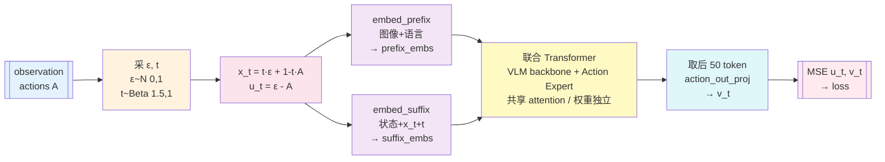

# pi0 forward 函数学习笔记

读 `src/openpi/models_pytorch/pi0_pytorch.py` 里 `forward` 函数的心路历程。从疑问到澄清，按我踩过的顺序记录。

## 0. 入口：这个函数是干嘛的

`PI0Pytorch` 这个类同时承载 pi0 和 pi0.5 两种模型，`self.pi05 = config.pi05` 决定走哪个分支。

- `__init__`：搭骨架，定义两套专家权重（VLM backbone / PaliGemma + Action Expert）和几个 Linear 层。只跑一次
- `forward`：**每个训练 step 调一次**。接收 observation + 真实动作，返回 Flow Matching loss
- `sample_actions`：**推理时**调，从噪声 Euler 积分 10 步得到干净动作

今天的目标：把 `forward` 彻底搞懂。

---

## 1. 第一个困惑：noise 和 time 从哪来？

看 [pi0_pytorch.py:317](src/openpi/models_pytorch/pi0_pytorch.py#L317) 的签名：

```python
def forward(self, observation, actions, noise=None, time=None) -> Tensor:
```

一开始只读到函数体开头，以为 noise 和 time 是 observation 的一部分。后来才看清——它们是**函数参数**，默认 None，函数内部 [L327-L333](src/openpi/models_pytorch/pi0_pytorch.py#L327-L333) 会自己采样：

```python
if noise is None:
    noise = self.sample_noise(actions.shape, actions.device)  # ε ~ N(0,1)
if time is None:
    time = self.sample_time(actions.shape[0], actions.device)  # t ~ Beta(1.5, 1)
```

**设计意图**：正常训练靠内部采样，想复现 / 单元测试时外部可传固定值。

"noise 和 actions 形状一样"指的是**形状**（`[B, horizon, action_dim]`），不是值——值从 N(0,1) 独立采样，和真实动作的数值毫无关系。

---

## 2. 真实动作 A 从哪来

同样是参数传进来的——`actions` 就是 `[B, 50, action_dim]` 的真实示教数据。DataLoader 在外面已经采好了 batch：

```python
for batch in dataloader:
    loss = model(batch["observation"], batch["actions"])
```

`forward` 内部只用 `actions` 做两件事：
```python
x_t = time_expanded * noise + (1 - time_expanded) * actions   # 构造插值点
u_t = noise - actions                                          # 构造速度目标
```

---

## 3. 最大的坑：代码约定和论文约定相反！

论文写：

> A^τ = τ·A + (1-τ)·ε
> τ=0 → 纯噪声，τ=1 → 干净动作
> 推理：τ 从 0 积分到 1

代码写：

```python
x_t = t·ε + (1-t)·A       # t=0 干净，t=1 噪声
u_t = ε - A
```

验证：
- 代码 `time=0` → `x_t = 0·ε + 1·A = A`（干净）
- 代码 `time=1` → `x_t = 1·ε + 0·A = ε`（噪声）

**两者完全反了**。换元 `t_code = 1 - τ_paper` 可以互相转换，数学等价。

### Beta 采样方向

这个反向约定造成的最大混淆：

- 论文说"sample from beta distribution that emphasizes **lower (noisier)** timesteps"
- 代码是 `Beta(1.5, 1.0)`，**偏向大值**（均值 0.6）

矛盾？不矛盾。代码约定下，大 t 是噪声端。所以代码偏向大 t = 偏向噪声 = 论文说的"noisier timesteps"。**方向对上了，名字反了**。

### 推理方向

同样，论文说"integrate from τ=0 to τ=1"，代码 [L410](src/openpi/models_pytorch/pi0_pytorch.py#L410) 里：

```python
dt = -1.0 / num_steps      # 负步长
time = 1.0                 # 从 1 开始
while time >= -dt / 2:
    x_t = x_t + dt * v_t   # time 递减
```

代码是从 t=1（噪声）走到 t=0（干净），配合 `u = ε - A` 的反向定义，两个负号抵消，去噪方向仍然正确。

**心得**：后面再看任何公式，先问一句"这里 t=0 是啥端"。

---

## 4. VLM backbone + Action Expert 的分工（类 MoE 设计）

> **术语说明**：
> - 论文原话是 **"analogous to a mixture of experts with two mixture elements"**——说"**类似** MoE"，不是直接叫 MoE
> - 正式命名：**VLM backbone** (PaliGemma) + **Action Expert**（第二套权重）
> - routing 是**固定**的：图像/语言 → VLM backbone，state/action → Action Expert（和传统 MoE 的 learned routing 不同，没有 gating network）
> - 笔记中用 "MoE" 是简写直觉，严格说应是 "类 MoE"（MoE-inspired）
> - 之前用过的"双塔"是我借自 Two-Tower 推荐系统的类比，论文里没有这个说法

`embed_prefix` + `embed_suffix` 一开始没看懂为什么分两个函数。后来意识到对应两套专家：

| 函数 | 负责的 token | 对应的专家（论文叫法）| 代码 |
|------|------------|----------|------|
| `embed_prefix` | 图像 + 语言 | **VLM backbone**（PaliGemma, 3B） | [L187](src/openpi/models_pytorch/pi0_pytorch.py#L187) |
| `embed_suffix` | 状态 + 噪声动作 + 时间 | **Action Expert**（300M, 从头训）| [L238](src/openpi/models_pytorch/pi0_pytorch.py#L238) |

分开是因为两套专家用**不同的权重**（PaliGemma 是 3B 预训练 VLM，Action Expert 是 300M 从头训），但共享同一个 attention——所以 action token 的 Q 能直接看到图像/语言的 K、V，实现条件生成。

### `suffix_embs` 内部对应论文里的 action token 流程

pi0 分支（[L244-L287](src/openpi/models_pytorch/pi0_pytorch.py#L244-L287)）做了这几件事：

```python
state_emb = state_proj(state)                           # 1 个 state token
action_emb = action_in_proj(noisy_actions)              # 50 个 action token
time_emb = create_sinusoidal_pos_embedding(timestep)    # τ 编码
time_emb = expand_to_50                                 # 广播到 50 份
action_time_emb = MLP(concat(action_emb, time_emb))    # 融合 τ 进 action
suffix_embs = [state_emb, action_time_emb]              # 51 个 token
```

pi0.5 分支不一样：没有独立 state token，τ 不 concat 而是走 `time_mlp` 生成 `adarms_cond`，通过 **adaRMS**（adaptive RMSNorm）注入到 Action Expert 每一层。

---

## 5. attention mask 到底在做什么

[L365-L377](src/openpi/models_pytorch/pi0_pytorch.py#L365-L377) 这段一开始觉得晦涩：

```python
pad_masks = torch.cat([prefix_pad_masks, suffix_pad_masks], dim=1)
att_masks = torch.cat([prefix_att_masks, suffix_att_masks], dim=1)
att_2d_masks = make_att_2d_masks(pad_masks, att_masks)
```

关键是搞清楚 `att_masks` 是一个 **1D 的"块分隔标志"**：
- 值 `1`：新块开始，前面看不到我
- 值 `0`：和前一个 token 同块

pi0 的 `att_masks` 长这样 `[0,0,...(image+lang 全 0),1(state 开新块),1(action 开新块),0,0,...(action 内部全 0)]`。

`make_att_2d_masks` ([L52](src/openpi/models_pytorch/pi0_pytorch.py#L52)) 把这个 1D 标志展开成 `[B, L, L]` 的真正 attention 矩阵，效果：
- 图像/语言之间：全注意力
- 图像/语言 **看不到** 状态/动作
- 状态/动作 **能看到** 图像/语言（条件输入）
- 动作内部：双向（符合论文说的 "action expert uses a full bidirectional attention mask"）

这就是典型的 **prefix-LM** 结构。

---

## 6. 最终澄清：训练 vs 推理的根本区别

最让我花时间的点：网上的图很多画的是推理（10 步 Euler 循环 + KV cache），导致我一度以为训练也有循环。

| 特征 | 训练 `forward` | 推理 `sample_actions` |
|------|---------------|---------------------|
| 外层循环 | **没有** | 10 次 Euler |
| KV cache | 不用 | 用（prefix 缓存） |
| VLM 跑几次 | 1 次 | 1 次（算完缓存）|
| Action Expert 跑几次 | **1 次** | 10 次 |
| 最后干什么 | 算 MSE loss | 返回干净动作 |
| τ 怎么来 | 随机采 1 个 | 从 1 走到 0 积分 10 步 |

训练就是一个 batch 进去一次网络出来，**没有任何循环**。推理才需要循环。

---

## 7. Forward 完整流程 Mermaid

### 简版速查图（一页版）



**一句话总结**：采一对 `ε, t` → 构造 `x_t` 和目标速度 `u_t` → 两套专家 embed + 联合 attention → 投影得预测速度 `v_t` → MSE loss。

### 详细版

```mermaid
flowchart TD
    Start(["DataLoader batch<br/>observation + actions 50 步真实动作"]) --> Prep

    subgraph Prep["① 准备输入 L326"]
        P1["_preprocess_observation observation, train=True"]
        P2["图像归一化到 -1,1 float32<br/>拆成: 多路图像 list / 语言 token / 状态"]
        P1 --> P2
    end

    Prep --> Sample

    subgraph Sample["② 随机采样 ε 和 t  L327-333"]
        S1["noise ε ~ N 0,1<br/>形状同 actions: B,50,action_dim"]
        S2["time t ~ Beta 1.5,1<br/>均值 0.6 偏向大 t = 噪声多"]
        S3["t_expanded: B → B,1,1<br/>为广播做准备"]
        S1 --> S3
        S2 --> S3
    end

    Sample --> Interp

    subgraph Interp["③ 构造 Flow Matching 目标 L335-348"]
        I1["x_t = t·ε + 1-t ·A<br/>t=0 → 干净 A / t=1 → 纯噪声 ε<br/>中间线性插值"]
        I2["u_t = ε - A<br/>真实速度场 回归目标<br/>注意: 不依赖 t 常数方向"]
        I1 -.同一批 ε,A.-> I2
    end

    Interp --> Embed

    subgraph Embed["④ 两套专家分别 embed L352-359"]
        direction LR

        subgraph EP["embed_prefix L187"]
            EP1["多路图像<br/>每路过 SigLIP vision encoder"]
            EP2["拼接: 每图 256 个 patch token"]
            EP3["语言 token<br/>过 PaliGemma embedding 层<br/>乘 sqrt d"]
            EP4["输出 prefix_embs<br/>图像+语言 token 序列"]
            EP1 --> EP2
            EP2 --> EP4
            EP3 --> EP4
        end

        subgraph ES["embed_suffix L238"]
            ES1["state → state_proj<br/>Linear 1 个 state token<br/>仅 pi0"]
            ES2["x_t → action_in_proj<br/>Linear 50 个 action token"]
            ES3["t → sin-cos 位置编码"]
            ES4A["pi0: action+time concat<br/>→ action_time_mlp 融合<br/>adarms_cond = None"]
            ES4B["pi0.5: action 保留<br/>t 过 time_mlp → adarms_cond<br/>通过 adaRMS 注入每层 RMSNorm"]
            ES5["输出 suffix_embs<br/>pi0: 1+50 = 51 tokens<br/>pi0.5: 50 tokens"]
            ES1 --> ES5
            ES2 --> ES4A
            ES3 --> ES4A
            ES2 --> ES4B
            ES3 --> ES4B
            ES4A --> ES5
            ES4B --> ES5
        end

        EDT["若模型 bf16: prefix/suffix 都转 bf16"]
        EP --> EDT
        ES --> EDT
    end

    Embed --> Mask

    subgraph Mask["⑤ 拼接 + Attention Mask L365-377"]
        M1["torch.cat prefix_embs, suffix_embs dim=1<br/>→ 完整 token 序列"]
        M2["pad_masks / att_masks 同样在 dim=1 拼接"]
        M3["make_att_2d_masks L52<br/>用 cumsum 比较展开成 B,L,L 布尔矩阵"]
        M4["mask 语义 - prefix-LM 结构<br/>• 图像/语言: 互相全注意力<br/>• 动作: 内部双向 bidirectional<br/>• 动作 可以看 图像/语言 条件输入<br/>• 图像/语言 不能看 动作 防泄露"]
        M5["_prepare_attention_masks_4d<br/>bool → 加性 mask: True→0, False→-inf<br/>shape: B,1,L,L"]
        M6["position_ids = cumsum pad_masks - 1<br/>padding 位置不占位置编码"]
        M1 --> M3
        M2 --> M3
        M3 --> M4
        M4 --> M5
        M1 --> M6
    end

    Mask --> Trans

    subgraph Trans["⑥ 联合 Transformer forward L380-396 VLM+Expert 共享 attention"]
        direction LR
        TIn["输入<br/>inputs_embeds=[prefix, suffix]<br/>attention_mask, position_ids<br/>adarms_cond=[None, t]<br/>use_cache=False"]
        TFn["PaliGemmaWithExpertModel<br/>.forward<br/>─────────────<br/>• 两套专家权重独立<br/>  PaliGemma / Action Expert<br/>• 每层 attention 时 K/V 跨专家拼接<br/>• 可选 gradient checkpoint"]
        TOut["输出<br/>[prefix_out, suffix_out]"]
        TIn --> TFn --> TOut
    end

    Trans --> Out

    subgraph Out["⑦ 取 action tokens → 投影回动作维度 L398-407"]
        O1["suffix_out 最后 action_horizon=50 个 token<br/>suffix_out[:, -50:, :]<br/>因为 pi0 还有 state token 在前"]
        O2["转 float32<br/>避免 bf16 投影数值误差"]
        O3["action_out_proj: Linear<br/>expert_width=1024 → action_dim"]
        O4["输出 v_t: B,50,action_dim<br/>模型预测的速度场"]
        O1 --> O2 --> O3 --> O4
    end

    Out --> Loss

    subgraph Loss["⑧ Flow Matching Loss L409-411"]
        L1["F.mse_loss u_t, v_t, reduction=none<br/>逐元素 MSE"]
        L2["返回 shape B,50,action_dim<br/>外部可按 mask 加权/再取 mean"]
        L1 --> L2
    end

    Loss --> End(["返回 loss tensor<br/>外部 loss.mean 后 backward<br/>PyTorch autograd 自动回传梯度到所有权重"])

    style Prep fill:#e3f2fd
    style Sample fill:#fff3e0
    style Interp fill:#fce4ec
    style Embed fill:#f3e5f5
    style EP fill:#ede7f6
    style ES fill:#ede7f6
    style Mask fill:#e8f5e9
    style Trans fill:#fff9c4
    style Out fill:#e0f7fa
    style Loss fill:#ffebee
```



---

## 8. 读代码的心得

几条可以沉淀的东西：

1. **看签名比看函数体先开始**：`def forward(self, observation, actions, noise=None, time=None)` 这一行就把输入输出规定死了，避免读到中间被"noise 哪来的"卡住
2. **公式约定看代码最稳**：论文和代码的 τ 方向可以完全相反，自己验证 `t=0` 和 `t=1` 各代入一次公式，立刻清楚
3. **两套专家要先分清楚再合并**：`embed_prefix`（PaliGemma）/ `embed_suffix`（Action Expert）先各自理解，再看 `torch.cat` + attention mask 怎么把它们粘起来
4. **训练和推理分开读**：同一个模型类有两条完全不同的代码路径（一个算 loss，一个跑 Euler），混着读会崩溃
5. **把 attention mask 1D 的块标志和 2D 矩阵对照起来看**：`make_att_2d_masks` 是理解 prefix-LM 的钥匙
6. **注释写"为什么"不写"做什么"**：变量名已经告诉我做什么了，注释应该说这一步在整体里的**位置**和**意图**

---

## 9. 下一步可以看什么

- [ ] `sample_actions` + `denoise_step`：推理优化（KV cache 怎么用）
- [ ] `PaliGemmaWithExpertModel.forward`：两套专家共享 attention 在底层怎么实现（K/V 跨专家拼接的细节）
- [ ] `embed_prefix` / `embed_suffix` 的细节：SigLIP 图像编码、adaRMS 具体形式
- [ ] 训练数据 pipeline：`observation` 和 `actions` 从 LeRobot dataset 到 tensor 的完整路径
